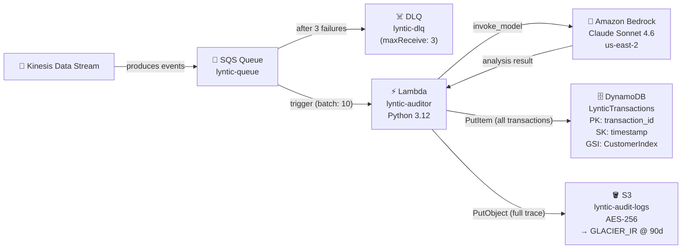

```mermaid
flowchart LR
    KDS["📡 Kinesis Data Stream"]
    SQS["📨 SQS Queue\nlyntic-queue"]
    DLQ["☠️ DLQ\nlyntic-dlq\n(maxReceive: 3)"]
    LAM["⚡ Lambda\nlyntic-auditor\nPython 3.12"]
    BED["🤖 Amazon Bedrock\nClaude Sonnet 4.6\nus-east-2"]
    DYN["🗄️ DynamoDB\nLynticTransactions\nPK: transaction_id\nSK: timestamp\nGSI: CustomerIndex"]
    S3["🪣 S3\nlyntic-audit-logs\nAES-256\n→ GLACIER_IR @ 90d"]

    KDS -->|"produces events"| SQS
    SQS -->|"trigger (batch: 10)"| LAM
    SQS -->|"after 3 failures"| DLQ
    LAM -->|"invoke_model"| BED
    BED -->|"analysis result"| LAM
    LAM -->|"PutItem (all transactions)"| DYN
    LAM -->|"PutObject (full trace)"| S3
```
