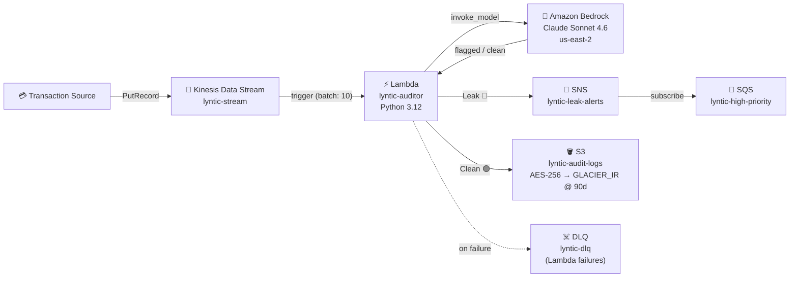

```mermaid
flowchart LR
    SRC["💳 Transaction Source"]
    KDS["📡 Kinesis Data Stream\nlyntic-stream"]
    LAM["⚡ Lambda\nlyntic-auditor\nPython 3.12"]
    BED["🤖 Amazon Bedrock\nClaude Sonnet 4.6\nus-east-2"]
    SNS["🔔 SNS\nlyntic-leak-alerts"]
    SQS["📨 SQS\nlyntic-high-priority"]
    S3["🪣 S3\nlyntic-audit-logs\nAES-256 → GLACIER_IR @ 90d"]
    DLQ["☠️ DLQ\nlyntic-dlq\n(Lambda failures)"]

    SRC -->|"PutRecord"| KDS
    KDS -->|"trigger (batch: 10)"| LAM
    LAM -->|"invoke_model"| BED
    BED -->|"flagged / clean"| LAM

    LAM -->|"Leak 🔴"| SNS
    SNS -->|"subscribe"| SQS

    LAM -->|"Clean 🟢"| S3

    LAM -.->|"on failure"| DLQ
```
